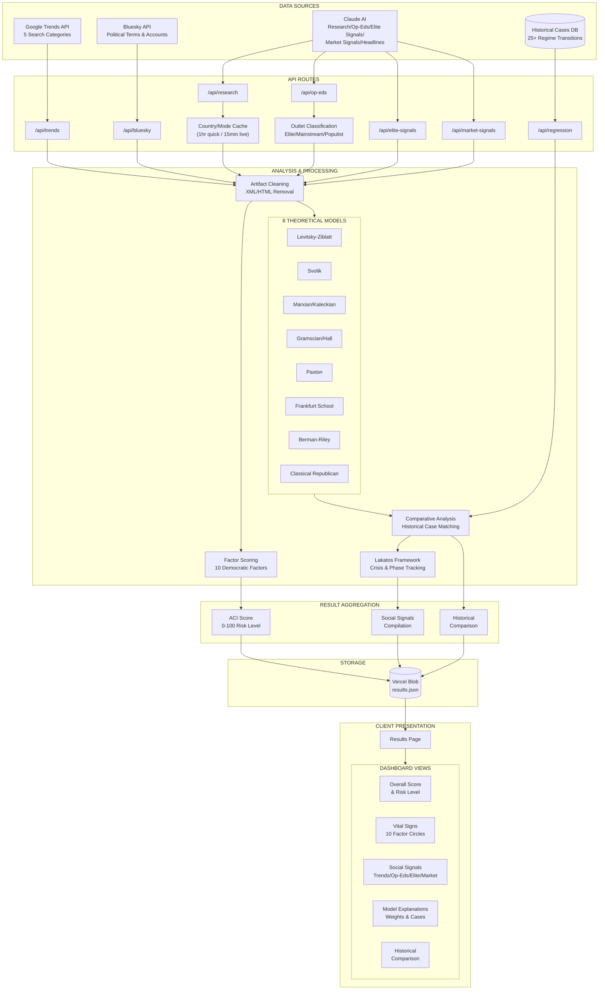

# Polybius ACI Data Flow Architecture

This document describes how the application queries datasets, analyzes them, and presents them to the client view.

## High-Level Workflow Diagram

## Pipeline Stages

### Stage 1: Data Querying

| Source | Description |
|--------|-------------|
| **Google Trends API** | Queries 5 search categories: exit (emigration), resistance (protests), naming (democracy terms), institutional (election concerns), pressFreedom |
| **Bluesky API** | Tracks 11 political terms and 9 key accounts for sentiment analysis |
| **Claude AI** | Web search-powered analysis for research, op-eds, elite signals, market signals, and headlines |
| **Historical Cases DB** | 25+ regime transition cases (Weimar, Hungary, Poland, Chile, etc.) with 10 factors each |

### Stage 2: Analysis & Processing

1. **Caching Layer** - Quick mode (1hr TTL) or Live mode (15min TTL)
2. **Artifact Cleaning** - Removes XML/HTML tags, decodes entities, strips citation markers
3. **Outlet Classification** - Categorizes media by class (elite/mainstream/populist) and affinity (regime/neutral/opposition)
4. **8 Theoretical Models** - Each applies different weights to 10 democratic factors:
   - Levitsky-Ziblatt (judicial independence, political competition)
   - Svolik (public opinion polarization, mobilizational balance)
   - Marxian/Kaleckian (corporate compliance)
   - Gramscian/Hall (media capture, public opinion)
   - Paxton (mobilizational balance, civil society)
   - Frankfurt School (media, public opinion)
   - Berman-Riley (mobilizational balance)
   - Classical Republican (judicial, federalism, public opinion)
5. **Comparative Analysis** - Calculates Euclidean distance to historical cases
6. **Lakatos Framework** - Tracks regime phases and crisis types
7. **Factor Scoring** - Scores 10 factors (0-100): judicial, federalism, political, media, civil, publicOpinion, mobilizationalBalance, stateCapacity, corporateCompliance, electionInterference

### Stage 3: Client Presentation

Results are published to Vercel Blob storage and fetched by the client, which displays:

- **Overall ACI Score** (0-100) with risk level badge and consolidation probability
- **Vital Signs Dashboard** - 10 circular progress indicators, color-coded by risk
- **Social Signals** - Trends heatmap, op-ed matrix, elite tracking, market gauges, Bluesky sentiment
- **Model Explanations** - Expandable cards with weights and case comparisons
- **Historical Comparison** - Most similar cases and predicted outcomes

## Key Files

| Component | Location |
|-----------|----------|
| Data Sources | `src/app/api/trends/`, `src/app/api/bluesky/`, `src/app/api/research/` |
| Analysis | `src/lib/regression.ts`, `src/lib/lakatos.ts` |
| Historical Data | `src/data/historical-cases.ts` |
| Client Views | `src/app/results/page.tsx`, `src/app/page.tsx` |
| Storage | `src/app/api/results/route.ts` (Vercel Blob) |
